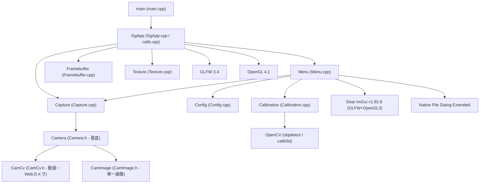

# ChArUco Board を使ったカメラキャリブレーションプログラム

本プログラムは、様々なカメラに対して **ChArUco (Charcoal ArUco) Board** を使用したカメラキャリブレーションを行い、カメラの内部パラメータ（焦点距離、主点）や歪みパラメータ（放射方向歪み、接線方向歪み）を算出・検証するアプリケーションです。

---

## 1. プログラムの構造とアーキテクチャ

本プログラムは、GLFW と OpenGL 4.1 をベースとしたウィンドウマネジメントおよび描画システムの上に、OpenCV（カメラ入力・画像処理）、Dear ImGui（GUI表示）、Native File Dialog Extended（ファイル選択）を統合した構造になっています。

### クラス構造・関係図 (Mermaid)



### 主要ファイルの役割

- **`main.cpp`**: プログラムのエントリポイント。`GgApp` オブジェクトを生成し実行します。
- **`calib.cpp`**: `GgApp::main` メソッドの実装（メインループ）。描画ループ、ArUcoマーカー/ボード検出、フレームバッファ制御を行います。
- **`GgApp.cpp / GgApp.h`**: ウィンドウ管理、OpenGLコンテキスト作成、イベントハンドリングを行う基底アプリケーションクラス。
- **`Calibration.cpp / Calibration.h`**: カメラキャリブレーションの処理（マーカー検出、コーナー情報記録、最適化計算、パラメータ読み書き）をカプセル化したクラス。
- **`Capture.cpp / Capture.h`**: カメラ入力デバイスや各種ファイル（画像・動画）入力を抽象化したクラス。
- **`Menu.cpp / Menu.h`**: Dear ImGui を用いた設定パネル、ボタン、メニューバーなどの GUI 制御クラス。
- **`Config.cpp / Config.h`**: アプリケーション設定や構成の読み書きを担当するクラス。
- **`Framebuffer.cpp / Texture.cpp`**: カメラフレームをGPU上でテクスチャとして描き、シェーダを適用するためのOpenGLラッパークラス。

---

## 2. ビルド手順

ビルド環境に合わせて CMake を使用してビルドを行うことができます。

### 依存ライブラリの自動ダウンロード (全OS共通)
本プログラムは、CMake の実行時に必要な外部依存関係（Dear ImGui, Native File Dialog Extended, OpenGL用ヘッダー, picojson, GLFW, OpenCV等）を自動的にダウンロードしてセットアップします。そのため、手動でのライブラリダウンロードや Python によるセットアップスクリプトの実行は不要です。

`cmake -B build` を実行するだけで、自動的に `libs` ディレクトリ以下に依存ライブラリが配置され、ビルド環境が構成されます。

---

### Windows 版 (Visual Studio 2022 / C++17)

#### 前提条件
- **Visual Studio 2022**（「C++によるデスクトップ開発」ワークロードがインストールされていること）
- **CMake** (バージョン 3.20 以上推奨)
- **Python** (依存ライブラリの自動セットアップ用)

#### ビルド手順
1. **VSソリューションの生成**:
   コマンドプロンプトまたは PowerShell でプロジェクトルートを開き、以下を実行して `build` ディレクトリにソリューションファイルを生成します。
   ```powershell
   cmake -G "Visual Studio 17 2022" -A x64 -B build
   ```
2. **ビルドの実行**:
   - **コマンドラインからビルドする場合**:
     ```powershell
     cmake --build build --config Debug --target calib
     # または Release 構成の場合:
     cmake --build build --config Release --target calib
     ```
   - **Visual Studio 2022 IDE からビルドする場合**:
     1. 生成された `build/calib.sln` を Visual Studio 2022 で開きます。
     2. 画面上部でビルド構成（`Debug` または `Release`）を選択します。
     3. メニューの **「ビルド」 ＞ 「ソリューションのビルド」** を選択します。

#### 実行・デバッグ方法
- ソリューションファイルを開くと、`calib` が自動的に**スタートアッププロジェクト**に設定されています。
  *(※ もし `ALL_BUILD` がスタートアッププロジェクトのままになっている場合は、一度 Visual Studio を閉じ、プロジェクトルートにある隠しフォルダ `.vs` を削除してからソリューションを再起動してください)*
- そのまま **F5キー**（または「デバッグの開始」）を押すと、プログラムが起動します。
- ポストビルド処理により、ビルド出力フォルダ（`build/Debug` または `build/Release`）へ、依存する OpenCV DLL やシェーダーファイル（`.vert` / `.frag`）、3Dモデルなどのアセット群が自動コピーされ、デバッグ作業ディレクトリも CMake によって自動構成されているため、すぐに単体実行・デバッグが行えます。
- ソリューションエクスプローラ内の **「Shader Files」** フィルタ（フォルダ）内にシェーダーファイルがまとめられており、IDE上で直接編集可能です。

---

### macOS 版 (Xcode / C++17)

#### 前提条件
- **macOS** (Xcode および Xcode Command Line Tools がインストールされていること)
- **CMake** (Homebrew等からインストール可能: `brew install cmake`)
- **Python**

#### ビルド手順
1. **Xcodeプロジェクトの生成**:
   ターミナルを開き、以下を実行して Xcode 向けプロジェクトを構成します。
   ```bash
   cmake -G Xcode -B build
   ```
2. **ビルドの実行**:
   - **コマンドラインからビルドする場合**:
     ```bash
     cmake --build build --config Release
     ```
   - **Xcode IDE からビルドする場合**:
     1. `build/calib.xcodeproj` を Xcode で開きます。
     2. スキームで `calib` ターゲットを選択します。
     3. **Product ＞ Build** (または `Cmd + B`) を実行します。

#### 実行・デバッグ方法
- Xcode 上で `calib` スキームを実行（`Cmd + R`）します。
- ビルドが完了すると、スタンドアロンで動作可能なアプリケーションバンドル `calib.app` が `build/Release/` または `build/Debug/` 配下に生成されます。
- アセットやシェーダーは自動的にバンドル内の `calib.app/Contents/Resources/` にパッケージ化されます。また、ビルドした OpenCV や GLFW の動的ライブラリ (`.dylib`) も `Contents/Frameworks/` にコピーされ、実行ファイルとのリンクパスが自動的に調整されるため、そのまま他マシンに配布して起動可能です。

---

### Ubuntu Linux 版

#### 前提条件
- **GCC** (C++17対応コンパイラ)
- **CMake**
- **PkgConfig**
- **各種開発用ライブラリパッケージ** (OpenCV, GLFW3, GTK+-3.0)
  - GTK+-3.0 はネイティブファイルダイアログ (NFDe) の表示に必須です。

#### ビルド手順
1. **システムの依存関係をインストール**:
   ターミナルで以下を実行し、必要なコンパイラとシステムライブラリをインストールします。
   ```bash
   sudo apt-get update
   sudo apt-get install build-essential cmake libopencv-dev libglfw3-dev libgtk-3-dev
   ```
2. **ビルドの実行**:
   ```bash
   # Makefile の生成
   cmake -B build
   
   # ビルド
   cmake --build build --config Release
   ```

#### 実行方法
- ビルドが成功すると、`build/` ディレクトリに実行ファイル `calib` が生成されます。
- **実行時の注意**:
  Linux環境では、アセットやシェーダーファイルをカレントディレクトリから読み込むため、**必ずプロジェクトのルートディレクトリから実行ファイルを指定して起動**してください。
  ```bash
  # プロジェクトのルートディレクトリにいる状態で起動します
  ./build/calib
  ```

---

## 3. アプリケーションの使用方法とキャリブレーション手順

キャリブレーションには、基準となる **ChArUco Board** の印刷物が必要です。

### 事前準備：ChArUco Board の生成
1. 本プログラムを起動し、メニューバーの **「ファイル」 ＞ 「ChArUco 画像作成」** をクリックします。
2. プロジェクトの作業ディレクトリに `ChArUcoBoard.png` が生成されます。
3. この画像を縮尺を変更せずに (100%のサイズで) 印刷し、平らな板（アクリル板や硬いダンボール等）に歪みがないように貼り付けてください。

---

### キャリブレーション手順 A：接続されている Web カメラを使ってオンラインで取得する
リアルタイムにカメラ映像をプレビューしながらキャリブレーションを行います。

1. **カメラの接続と開始**:
   - アプリケーション右側の **「入力」パネル** で、使用するカメラの `デバイス番号` (通常は `0` または `1`) を指定します。
   - 解像度やFPSを設定し、**「開始」** ボタンをクリックすると、カメラのリアルタイム映像が画面に描写されます。
2. **ボード検出の有効化**:
   - 右側の **「較正」パネル** にて、マーカー辞書（デフォルト: `DICT_4X4_50`）や印刷したグリッドの実寸法（マス目一辺の長さとマーカー一辺の長さ）を設定します。
   - **「detectBoard」** チェックボックスにチェックを入れます。印刷した ChArUco Board をカメラにかざすと、認識されたコーナー位置に赤いマーカーが重ねて描画されます。
3. **キャリブレーション用フレームの記録**:
   - ボードを様々な角度（正面、傾ける、カメラに近い位置、遠い位置、四隅など）に向け、認識の緑/赤線が安定している状態で **「取得」** ボタンをクリックします。
   - キャリブレーションの精度を高めるため、**最低 6 フレーム以上**（推奨 10〜20 フレーム以上）のサンプルを異なる角度・位置で記録してください。
4. **キャリブレーションの実行**:
   - 十分なサンプルが記録されたら、較正パネルの **「較正」** ボタンをクリックします。
   - 計算が成功すると、再投影誤差（Error）とキャリブレーション結果が適用され、チェッカーボード上に緑色の3D軸や歪み補正結果（シェーダ変更時）が描画されるようになります。
   - 結果を破棄したい場合は **「消去」** を押すことでやり直せます。
5. **結果の保存**:
   - メニューバーの **「ファイル」 ＞ 「較正ファイルを保存」** を選択し、カメラパラメータ（`cameraMatrix` および `distCoeffs`）を JSON 形式で保存します。

---

### キャリブレーション手順 B：他のカメラで撮影した複数の画像ファイルを使ってオフラインで取得する
本プログラムを動作させられないカメラや、あらかじめ別撮りした複数の写真からパラメータを求めたい場合に使用します。

1. **写真の撮影**:
   - キャリブレーション対象のカメラを使用し、ChArUco Board を様々な角度・位置から写した静止画写真を複数枚（10枚以上を推奨）撮影します。
   - 写真は PC に転送しておきます（PNG, JPG 等に対応）。
2. **画像の読み込みと一括検出**:
   - 本プログラムを起動し、メニューバーの **「ファイル」 ＞ 「較正用画像から取得」** を選択します。
   - ファイル選択ダイアログが表示されるので、用意した複数枚の写真画像を**すべて複数選択**して「開く」をクリックします。
   - プロジェクトは自動的に各画像を順番に読み込み、ChArUco Board のコーナー検出を行ってサンプルデータを内部に蓄積します。
3. **キャリブレーションの実行**:
   - 読み込み完了後、較正パネルの **「較正」** ボタンをクリックします。
   - 計算が実行され、結果が適用されます。
4. **結果の保存**:
   - オンライン時と同様に、メニューバーの **「ファイル」 ＞ 「較正ファイルを保存」** から、計算結果のパラメータ（JSONファイル）を出力して完了です。
