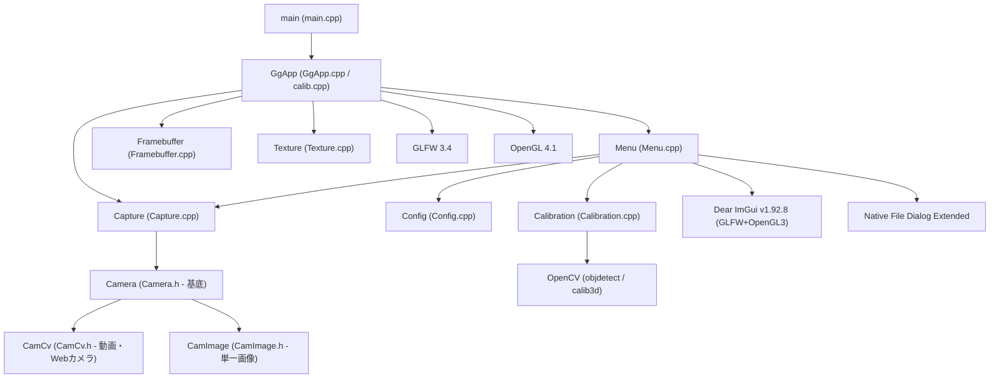

# ChArUco Board を使ったカメラキャリブレーションプログラム

本プログラムは、様々なカメラに対して **ChArUco (Charcoal ArUco) Board** を使用したカメラキャリブレーションを行い、カメラの内部パラメータ（焦点距離、主点）や歪みパラメータ（放射方向歪み、接線方向歪み）を算出・検証するアプリケーションです。

---

## 1. プログラムの構造とアーキテクチャ

本プログラムは、GLFW と OpenGL 4.1 をベースとしたウィンドウマネジメントおよび描画システムの上に、OpenCV（カメラ入力・画像処理）、Dear ImGui（GUI表示）、Native File Dialog Extended（ファイル選択）を統合した構造になっています。

### クラス構造・関係図 (Mermaid)



### 主要ファイルの役割

- **`main.cpp`**: プログラムのエントリポイント。`GgApp` オブジェクトを生成し実行します。
- **`calib.cpp`**: `GgApp::main` メソッドの実装（メインループ）。描画ループ、ArUcoマーカー/ボード検出、フレームバッファ制御を行います。
- **`GgApp.cpp / GgApp.h`**: ウィンドウ管理、OpenGLコンテキスト作成、イベントハンドリングを行う基底アプリケーションクラス。
- **`Calibration.cpp / Calibration.h`**: カメラキャリブレーションの処理（マーカー検出、コーナー情報記録、最適化計算、パラメータ読み書き）をカプセル化したクラス。
- **`Capture.cpp / Capture.h`**: カメラ入力デバイスや各種ファイル（画像・動画）入力を抽象化したクラス。
- **`Menu.cpp / Menu.h`**: Dear ImGui を用いた設定パネル、ボタン、メニューバーなどの GUI 制御クラス。
- **`Config.cpp / Config.h`**: アプリケーション設定や構成の読み書きを担当するクラス。
- **`Framebuffer.cpp / Texture.cpp`**: カメラフレームをGPU上でテクスチャとして描き、シェーダを適用するためのOpenGLラッパークラス。

---

## 2. ビルド手順

ビルド環境に合わせて CMake を使用してビルドを行うことができます。

### 依存ライブラリの自動ダウンロード (全OS共通)
ビルドの前に、プロジェクトのルートディレクトリで以下の Python スクリプトを実行し、必要な外部依存関係（Dear ImGui, NFDe, OpenGL用ヘッダー, picojson等）を自動セットアップします。
```bash
python download_deps.py
```
※Windows / macOS の場合は、OpenCV と GLFW のバイナリ・ソースコードも自動で `lib` ディレクトリに取得されます。

### Windows 版 (Visual Studio 2022 / C++17)
1. ビルドディレクトリを作成して構成します：
   ```bash
   cmake -G "Visual Studio 17 2022" -A x64 -B build
   ```
2. ビルドを実行します：
   ```bash
   cmake --build build --config Release --target calib
   ```
   - コピー対象のDLLやシェーダ、アセットファイルはビルド時に出力ディレクトリ (`build/Release/`) に自動で配置されます。
   - Visual Studio 2022 で `build/calib.sln` を開き、デバッグ実行（F5）するだけで動作可能です（デバッグ時の環境変数や作業ディレクトリは CMake で自動設定されます）。
   - セットアッププロジェクト (`INSTALL/INSTALL.vdproj`) がソリューションに含まれているため、VS上でインストーラーを作成することも可能です。

### macOS 版 (Xcode / C++17)
1. ビルドディレクトリを Xcode プロジェクトとして構成します：
   ```bash
   cmake -G Xcode -B build
   ```
2. Xcode上でビルドすると、スタンドアロン動作可能な `calib.app`（アプリケーションバンドル）が生成されます。
   - 必要なシェーダや設定ファイルはバンドル内の `Contents/Resources/` に自動配置されます。
   - ビルドされた OpenCV や GLFW の動的ライブラリ (`.dylib`) は `Contents/Frameworks/` に自動でコピーされ、`install_name_tool` でバンドル相対パスへと書き換えられます。

### Ubuntu Linux 版
1. OpenCV および GLFW、GTK+-3.0 をシステムにインストールします：
   ```bash
   sudo apt-get update
   sudo apt-get install build-essential cmake libopencv-dev libglfw3-dev libgtk-3-dev
   ```
2. ビルドディレクトリを作成してビルドします：
   ```bash
   cmake -B build
   cmake --build build --config Release
   ```

---

## 3. アプリケーションの使用方法とキャリブレーション手順

キャリブレーションには、基準となる **ChArUco Board** の印刷物が必要です。

### 事前準備：ChArUco Board の生成
1. 本プログラムを起動し、メニューバーの **「ファイル」 ＞ 「ChArUco 画像作成」** をクリックします。
2. プロジェクトの作業ディレクトリに `ChArUcoBoard.png` が生成されます。
3. この画像を縮尺を変更せずに (100%のサイズで) 印刷し、平らな板（アクリル板や硬いダンボール等）に歪みがないように貼り付けてください。

---

### キャリブレーション手順 A：接続されている Web カメラを使ってオンラインで取得する
リアルタイムにカメラ映像をプレビューしながらキャリブレーションを行います。

1. **カメラの接続と開始**:
   - アプリケーション右側の **「入力」パネル** で、使用するカメラの `デバイス番号` (通常は `0` または `1`) を指定します。
   - 解像度やFPSを設定し、**「開始」** ボタンをクリックすると、カメラのリアルタイム映像が画面に描写されます。
2. **ボード検出の有効化**:
   - 右側の **「較正」パネル** にて、マーカー辞書（デフォルト: `DICT_4X4_50`）や印刷したグリッドの実寸法（マス目一辺の長さとマーカー一辺の長さ）を設定します。
   - **「detectBoard」** チェックボックスにチェックを入れます。印刷した ChArUco Board をカメラにかざすと、認識されたコーナー位置に赤いマーカーが重ねて描画されます。
3. **キャリブレーション用フレームの記録**:
   - ボードを様々な角度（正面、傾ける、カメラに近い位置、遠い位置、四隅など）に向け、認識の緑/赤線が安定している状態で **「取得」** ボタンをクリックします。
   - キャリブレーションの精度を高めるため、**最低 6 フレーム以上**（推奨 10〜20 フレーム以上）のサンプルを異なる角度・位置で記録してください。
4. **キャリブレーションの実行**:
   - 十分なサンプルが記録されたら、較正パネルの **「較正」** ボタンをクリックします。
   - 計算が成功すると、再投影誤差（Error）とキャリブレーション結果が適用され、チェッカーボード上に緑色の3D軸や歪み補正結果（シェーダ変更時）が描画されるようになります。
   - 結果を破棄したい場合は **「消去」** を押すことでやり直せます。
5. **結果の保存**:
   - メニューバーの **「ファイル」 ＞ 「較正ファイルを保存」** を選択し、カメラパラメータ（`cameraMatrix` および `distCoeffs`）を JSON 形式で保存します。

---

### キャリブレーション手順 B：他のカメラで撮影した複数の画像ファイルを使ってオフラインで取得する
本プログラムを動作させられないカメラや、あらかじめ別撮りした複数の写真からパラメータを求めたい場合に使用します。

1. **写真の撮影**:
   - キャリブレーション対象のカメラを使用し、ChArUco Board を様々な角度・位置から写した静止画写真を複数枚（10枚以上を推奨）撮影します。
   - 写真は PC に転送しておきます（PNG, JPG 等に対応）。
2. **画像の読み込みと一括検出**:
   - 本プログラムを起動し、メニューバーの **「ファイル」 ＞ 「較正用画像から取得」** を選択します。
   - ファイル選択ダイアログが表示されるので、用意した複数枚の写真画像を**すべて複数選択**して「開く」をクリックします。
   - プロジェクトは自動的に各画像を順番に読み込み、ChArUco Board のコーナー検出を行ってサンプルデータを内部に蓄積します。
3. **キャリブレーションの実行**:
   - 読み込み完了後、較正パネルの **「較正」** ボタンをクリックします。
   - 計算が実行され、結果が適用されます。
4. **結果の保存**:
   - オンライン時と同様に、メニューバーの **「ファイル」 ＞ 「較正ファイルを保存」** から、計算結果のパラメータ（JSONファイル）を出力して完了です。
