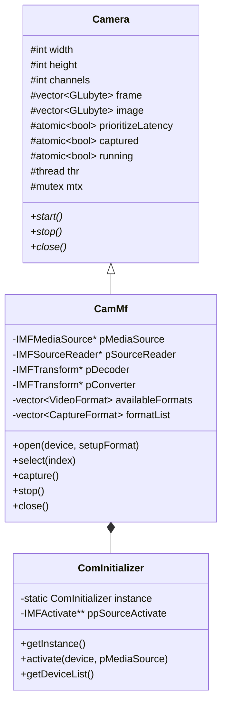

# 【勉強会ハンドアウト】calib 徹底解剖
## 〜 ChArUco 標本自動取得と先進的カメラキャプチャ（Media Foundation & libcamera）の設計と実装 〜

---

### 【目次】
1. **[タイムテーブル & 勉強会の目的](#1-タイムテーブル--勉強会の目的)**
2. **[calib 全体アーキテクチャとパイプライン概要](#2-calib-全体アーキテクチャとパイプライン概要)**
3. **[第1部: ChArUco Board によるカメラ較正と標本自動取得アルゴリズム](#3-第1部-charuco-board-によるカメラ較正と標本自動取得アルゴリズム)**
   - 3.1 ChArUco Board の原理と優位性
   - 3.2 ワンマン較正の課題と自動取得の着眼点
   - 3.3 モーション検出・静止判定アルゴリズム (`updateMotion`)
   - 3.4 統計モーメントによる幾何特徴抽出と多様性判定 (`computeFeatures`, `isDiverseEnough`)
   - 3.5 状態遷移ループ・クールダウン・音響フィードバック
4. **[第2部: Microsoft Media Foundation を使ったキャプチャクラス CamMf](#4-第2部-microsoft-media-foundation-を使ったキャプチャクラス-cammf)**
   - 4.1 なぜ OpenCV VideoCapture から脱却したのか？
   - 4.2 クラス構造と基底クラス `Camera`
   - 4.3 COM / Media Foundation のライフサイクル管理 (`ComInitializer`)
   - 4.4 フォーマット列挙と遅延初期化 (`enumerateFormats`, `setFormat`)
   - 4.5 MFT デコーダとカラーコンバータの動的パイプライン構築
   - 4.6 キャプチャスレッドループ (`CamMf::capture`) とバッファ制御
   - 4.7 低遅延モード vs 全フレーム処理モード、および安全なリソース解放
5. **[第3部: libcamera を使ったキャプチャクラス CamLibcam](#5-第3部-libcamera-を使ったキャプチャクラス-camlibcam)**
   - 5.1 Linux / Raspberry Pi カメラスタックの変遷と libcamera
   - 5.2 libcamera のコア概念（CameraManager, StreamRole, Request-Buffer モデル）
   - 5.3 クラス構造と CameraManager シングルトン
   - 5.4 ストリーム設定とフォーマットネゴシエーション（ゼロコピー最適化）
   - 5.5 `FrameBufferAllocator` による DMA バッファ確保と `mmap`
   - 5.6 非同期リクエスト駆動コールバック (`requestComplete`) と色空間変換
   - 5.7 リクエストの再利用 (`reuse`) とストリームループ
6. **[第4部: キャプチャバックエンドの比較まとめ & 付録](#6-第4部-キャプチャバックエンドの比較まとめ--付録)**
   - 6.1 バックエンド比較表（CamCv vs CamMf vs CamLibcam）
   - 6.2 トラブルシューティング & FAQ

---

## 1. タイムテーブル & 勉強会の目的

| 時間 | セクション | 主な解説トピック |
| :---: | :--- | :--- |
| **00:00 - 00:15 (15分)** | **イントロダクション** | プロジェクトの目的、パイプラインの役割分担、教材としての着眼点 |
| **00:15 - 00:50 (35分)** | **第1部: ChArUco Board と自動取得** | ChArUcoの原理、手振れ・重複防止、画像モーメント数学、ソースコード解説 |
| **00:50 - 01:25 (35分)** | **第2部: Media Foundation (`CamMf`)** | COM/MF初期化、MFTデコーダ/コンバータ、ストリーム変更対応、低遅延制御 |
| **01:25 - 01:55 (30分)** | **第3部: libcamera (`CamLibcam`)** | 組み込みLinuxカメラスタック、DMAバッファ/mmap、非同期リクエストモデル |
| **01:55 - 02:00 (5分)** | **まとめ & 質疑応答** | プラットフォーム比較、Q&A |

### 本勉強会の目的
1. **キャリブレーションの品質と作業効率の両立**: 一人作業でも高品質（低再投影誤差）なキャリブレーション標本を収集できるアルゴリズム的工夫を理解する。
2. **プラットフォーム固有の先進的ビデオ入力 API の習得**:
   - Windows における COM / Media Foundation Transform (MFT) のネイティブ実装
   - Linux / Raspberry Pi における libcamera の DMA バッファ・非同期リクエスト駆動実装
3. **教材としての美しいアーキテクチャ設計**: プラットフォーム依存型を UI や描画ループに露出させず、オブジェクト指向と現代 C++ (C++17) のイディオム（RAII, atomic, シングルトン）を活用したモジュール設計を学ぶ。

---

## 2. calib 全体アーキテクチャとパイプライン概要

### 2.1 CPU（OpenCV）と GPU（OpenGL / GLSL）の役割分担
`calib` は、カメラから映像を取得し、ChArUco Board を検出してカメラ内部パラメータ（内部行列 $K$、歪み係数 $D$）を算出し、その結果を GLSL シェーダーに渡してリアルタイムに歪み補正・画角展開を行うアプリケーションです。

```
[カメラ入力] (CamMf / CamLibcam / CamCv)
      │ (CPU メモリ上のフレームバッファ: BGRA)
      ▼
[OpenCV パイプライン]
      ├─ ChArUco Board 検出 (cv::aruco::CharucoDetector)
      ├─ 静止検知 & 幾何多様性判定 (Calibration::updateMotion, isDiverseEnough)
      ├─ 標本記録 & 較正計算 (Calibration::calibrate -> K, D 算出)
      ▼ (キャプチャテクスチャ転送: PBO / glTexSubImage2D)
[OpenGL / GLSL パイプライン]
      ├─ 第1パス (歪み補正): undistortion.vert / undistortion.frag
      ├─ 第2パス (投影展開): orthographic / stereographic / equirectangular
      ▼
[ディスプレイ表示] (Dear ImGui UI + contain 方式中央描画)
```

---

## 3. 第1部: ChArUco Board によるカメラ較正と標本自動取得アルゴリズム

### 3.1 ChArUco Board の原理と優位性
カメラ較正の精度は、標本点（チェッカーの交点）の画像上での検出精度に依存します。

- **従来のチェッカーボード (Chessboard)**:
  - 白黒の格子交点を使用。交点の検出精度（サブピクセル）は非常に高い。
  - **欠点**: ボードの一部が画面外に見切れたり、手で隠れたり（オクルージョン）すると、格子全体のインデックス照合に失敗し、**1点も検出できない**。画角の最周辺部（歪みの最も激しい場所）の標本取得が極めて困難。
- **ArUco マーカー (Marker)**:
  - 2値コードを持つ独立マーカー。各マーカーに固有 ID が付与されるため、一部が隠れても検出可能。
  - **欠点**: マーカーの四隅はサブピクセル交点検出に比べ、コーナー精度が劣る。
- **ChArUco Board (ArUco + Chessboard のハイブリッド)**:
  - チェッカーパターンの内部に ArUco マーカーを埋め込んだボード。
  - **メリット**: ArUco マーカーにより各チェッカー交点の「絶対 ID」を一意に特定できるため、**ボードが画面端で見切れても、手で隠れていても、検出できた交点のみを確実に利用可能**。しかも交点部分はチェッカー交点なので、サブピクセル精度の高い幾何座標が得られる。

---

### 3.2 ワンマン較正の課題と自動取得の着眼点
カメラキャリブレーションで良好な結果（再投影誤差 $< 0.5$ px）を得るには、以下の2条件が必須です：
1. **モーションブラーの排除**: シャッターを切る瞬間にボードやカメラが動いていると、エッジがぼやけてコーナー検出位置が数ピクセル狂う。
2. **標本の幾何多様性**: 画面の中央だけでなく四隅、至近距離（大）から遠距離（小）、正面向きから斜め傾け（ロール・ピッチ・ヨー）まで、**空間的に多様な姿勢**の標本が必要。同一姿勢の標本を何枚集めても行列のランクが上がらず、過学習または特異解に陥る。

> **課題**: 作業者が片手にボードを持ち、もう片方の手で PC のキーボードやマウスを操作してシャッターを切ると、どうしてもブレが生じ、構図も固定化しやすい。
>
> **解決策**: **「静止判定」** と **「幾何モーメントによる多様性判定」** を組み合わせた完全自動キャプチャ！

---

### 3.3 モーション検出・静止判定アルゴリズム (`updateMotion`)

#### アルゴリズムの流れ
1. 現在フレームで検出された ChArUco コーナー ID (`charucoIds`) と、直前フレームのコーナー ID (`prevCharucoIds`) を照合する。
2. 両フレームに共通して存在するコーナーのピクセル移動距離（ユークリッド距離）を計算する。
3. 共通コーナーの平均変位量 `currentMotion` (px) を求める。
4. 平均変位量が許容閾値（既定: `2.0` px）以下であれば静止中と判定し、タイマー `stableDuration` にフレーム間隔 `deltaTime` を積算。
5. 閾値を超えたら「動いた」と判断し、タイマーを即座に `0.0` にリセット。
6. 静止状態が `minStableTime`（既定: `0.6` 秒）継続した場合、`isCurrentlyStable = true` と判定する。

#### 実装コード解説 (`Calibration.cpp` L573-L635)
```cpp
void Calibration::updateMotion(float deltaTime, float motionThresholdPx, float minStableTime, int minCorners)
{
  // 検出コーナー数が最低必要数(6点)未満、または直前フレームが存在しない場合
  if (charucoCorners.size() < static_cast<size_t>(minCorners) || prevCharucoCorners.empty())
  {
    currentMotion = 999.0f;
    stableDuration = 0.0f;
    isCurrentlyStable = false;
    prevCharucoCorners = charucoCorners;
    prevCharucoIds = charucoIds;
    return;
  }

  // 共通するコーナー ID を探索し、ピクセル変位量を合算
  float totalDist = 0.0f;
  int commonCount = 0;

  for (size_t i = 0; i < charucoIds.size(); ++i)
  {
    const int id = charucoIds[i];
    for (size_t j = 0; j < prevCharucoIds.size(); ++j)
    {
      if (prevCharucoIds[j] == id)
      {
        totalDist += static_cast<float>(cv::norm(charucoCorners[i] - prevCharucoCorners[j]));
        ++commonCount;
        break;
      }
    }
  }

  // 共通コーナーが4点以上あれば平均変位量を算出
  if (commonCount >= std::min(4, minCorners))
  {
    currentMotion = totalDist / commonCount;
  }
  else
  {
    currentMotion = 999.0f; // 大きな移動があったとみなす
  }

  // 変位量が閾値(2.0px)以下ならタイマーを積算、超えていればリセット
  if (currentMotion <= motionThresholdPx)
  {
    stableDuration += deltaTime;
  }
  else
  {
    stableDuration = 0.0f;
  }

  // 静止必要時間(0.6秒)を満たせば静止と判定
  isCurrentlyStable = (stableDuration >= minStableTime);

  // 次フレームのために現在の情報を保存
  prevCharucoCorners = charucoCorners;
  prevCharucoIds = charucoIds;
}
```

---

### 3.4 統計モーメントによる幾何特徴抽出と多様性判定 (`computeFeatures`, `isDiverseEnough`)

静止したからといって、同じ場所・同じ姿勢で何枚も記録しては意味がありません。直前に記録した標本と比べて「位置」「距離（スケール）」「傾き」が十分に変化しているかを調べます。

#### 数学的背景: 画像モーメント (Image Moments)
検出されたコーナー点群 $\{ (x_i, y_i) \}_{i=1}^N$ に対し、`cv::moments` を用いて以下のモーメントを計算します。

1. **0次モーメント（点の総数）**:
   $$m_{00} = \sum_{i} 1 = N$$
2. **1次モーメント（座標の総和）**:
   $$m_{10} = \sum_{i} x_i, \quad m_{01} = \sum_{i} y_i$$
3. **重心 (Centroid) $(\bar{x}, \bar{y})$**:
   $$\bar{x} = \frac{m_{10}}{m_{00}}, \quad \bar{y} = \frac{m_{01}}{m_{00}}$$
   $\implies$ **ボードが画像内のどこにあるか（位置）を表す。**
4. **2次中心モーメント（重心まわりの分散・共分散）**:
   $$\mu_{20} = \frac{1}{N} \sum_{i} (x_i - \bar{x})^2, \quad \mu_{02} = \frac{1}{N} \sum_{i} (y_i - \bar{y})^2, \quad \mu_{11} = \frac{1}{N} \sum_{i} (x_i - \bar{x})(y_i - \bar{y})$$
5. **慣性半径 (Spread / Scale)**:
   $$R_{\text{spread}} = \sqrt{\mu_{20} + \mu_{02}}$$
   $\implies$ 重心からの点群の平均的な幾何学的広がり。外接矩形（Bouding Box）と違い、一部の点が見切れたりオクルージョンが発生しても外れ値に強い。**カメラとボードの距離（見かけの大きさ）を表す。**
6. **主軸角度 (Orientation Angle)**:
   $$\theta = \frac{1}{2} \operatorname{atan2}(2\mu_{11}, \mu_{20} - \mu_{02})$$
   $\implies$ 慣性楕円の長軸の傾き（$-90^\circ \sim +90^\circ$）。**画像平面内でのボードの傾きを表す。**

#### 実装コード解説 (`Calibration.cpp` L531-L562)
```cpp
Calibration::BoardPoseFeatures Calibration::computeFeatures(const std::vector<cv::Point2f>& corners)
{
  BoardPoseFeatures features;
  if (corners.size() >= 4)
  {
    cv::Moments m = cv::moments(corners);
    if (m.m00 > 0.0)
    {
      // 1. 重心位置 (Centroid)
      features.centroid = cv::Point2f(static_cast<float>(m.m10 / m.m00), static_cast<float>(m.m01 / m.m00));

      const double mu20 = m.mu20 / m.m00;
      const double mu02 = m.mu02 / m.m00;
      const double mu11 = m.mu11 / m.m00;

      // 2. 慣性半径 (Spread / Scale)
      features.spread = static_cast<float>(std::sqrt(std::max(0.0, mu20 + mu02)));

      // 3. 主軸角度 (Orientation Angle) [度数法]
      features.angleDeg = static_cast<float>(0.5 * std::atan2(2.0 * mu11, mu20 - mu02) * 180.0 / CV_PI);
    }
  }
  return features;
}
```

#### 多様性チェックの実装 (`Calibration.cpp` L646-L679)
3つの条件のうち **いずれか1つでも** 閾値をクリアすれば「十分な多様性あり（記録許可）」と判定します：
1. **重心移動量**: 画面対角線長に対し $\ge 5\%$ 移動したか？
2. **スケール変化率**: 慣性半径が直前標本比で $\ge 12\%$ 伸縮したか？
3. **主軸角度変化**: 傾きが $\ge 8^\circ$ 変化したか？（$0^\circ \sim 90^\circ$ の周期性を考慮）

```cpp
bool Calibration::isDiverseEnough(float minDistanceRatio, float minScaleRatio, float minAngleDeg) const
{
  if (!hasRecordedShot || allCorners.empty()) return true; // 初回は無条件パス
  if (charucoCorners.size() < 4) return false;

  const auto cur = computeFeatures(charucoCorners);

  // 1. 重心移動量比率 (画像対角線長に対する比率)
  const float diag = std::hypot(static_cast<float>(size.width), static_cast<float>(size.height));
  const float dist = static_cast<float>(cv::norm(cur.centroid - lastRecordedFeatures.centroid));
  if (diag > 0.0f && (dist / diag) >= minDistanceRatio) return true;

  // 2. スケール変化率
  if (lastRecordedFeatures.spread > 0.0f)
  {
    const float scaleDiff = std::abs(cur.spread - lastRecordedFeatures.spread) / lastRecordedFeatures.spread;
    if (scaleDiff >= minScaleRatio) return true;
  }

  // 3. 主軸角度の変化 (0°〜90° の周期性を考慮)
  float angleDiff = std::abs(cur.angleDeg - lastRecordedFeatures.angleDeg);
  while (angleDiff > 90.0f) angleDiff = std::abs(180.0f - angleDiff);
  if (angleDiff >= minAngleDeg) return true;

  return false; // すべて未達なら重複と判定
}
```

---

### 3.5 状態遷移ループ・クールダウン・音響フィードバック
`Menu::updateAutoCapture` (`Menu.cpp` L1417-L1463) が毎フレーム実行されます：
1. `isStable()` かつ `isDiverseEnough()` が成立。
2. `calibration.recordCorners()` で標本を保存。
3. **クールダウンタイマー**（`1.5` 秒）を設定し、連続トリガーを防止（作業者が次の姿勢に移行する時間を確保）。
4. **音響フィードバック**:
   - Windows: `std::thread([] { Beep(1200, 100); }).detach();`（UI をブロックしない別スレッド再生）
   - Linux: `std::cout << '\a' << std::flush;`（端末ベル文字）

---

## 4. 第2部: Microsoft Media Foundation を使ったキャプチャクラス CamMf

### 4.1 なぜ OpenCV VideoCapture から脱却したのか？
OpenCV の標準 `cv::VideoCapture` は手軽ですが、以下の重大な課題があります：
- **DirectShow 依存のオーバーヘッド**: Windows において古い DirectShow バックエンドや汎用 MSMF ラッパーを経由するため、内部で数フレーム分のバッファリングが生じ、レイテンシ（遅延）が大きくなる。
- **MJPG / H.264 デコードの非効率性**: 高解像度・高fps（例: 4K 30fps や 1080p 60fps）USB カメラの多くは MJPG や H.264 でストリームを出力します。OpenCV 内部でのソフトウェアデコードでは CPU 負荷が過大になり、コマ落ちが発生する。
- **フォーマット・解像度切り替えの遅延**: デバイスの列挙時にすべてのモードでデコーダ初期化が走り、UI が数秒間フリーズする。

> **`CamMf` のアプローチ**:
> Microsoft Media Foundation の Low-Level API（Source Reader + MFT）を直接操作。
> ハードウェアアクセラレーションデコード、低遅延フラグ、遅延初期化、マルチスレッド分離を徹底。

---

### 4.2 クラス構造と基底クラス `Camera`
`CamMf` は抽象基底クラス `Camera` (`Camera.h`) を継承しています。



---

### 4.3 COM / Media Foundation のライフサイクル管理 (`ComInitializer`)
COM オブジェクトや Media Foundation はプロセス全体で初期化・終了を対称に管理する必要があります。`CamMf` ではプライベートなシングルトンクラス `ComInitializer` (`CamMf.cpp` L55-L195) を導入しています。

- **初期化**:
  1. `CoInitializeEx(nullptr, COINIT_MULTITHREADED)` でマルチスレッド COM を初期化。
  2. `MFStartup(MF_VERSION, MFSTARTUP_FULL)` で Media Foundation を起動。
  3. `MFCreateAttributes` で属性ストアを作成し、`MF_DEVSOURCE_ATTRIBUTE_SOURCE_TYPE_VIDCAP_GUID` を指定。
  4. `MFEnumDeviceSources` でシステムに接続されたビデオキャプチャデバイスを列挙。
- **終了（デストラクタ）**:
  - `SafeRelease` でメディアソースを全解放 $\to$ `CoTaskMemFree` $\to$ `MFShutdown()` $\to$ `CoUninitialize()`。
  - プロセス終了時に確実にリソースが解放される RAII 設計。

---

### 4.4 フォーマット列挙と遅延初期化 (`enumerateFormats`, `setFormat`)

#### 遅延初期化 (Lazy Initialization) の徹底
カメラを `open(device, false)` で開いた際は、重いデコーダの作成やバッファ確保を行わず、利用可能なメディアタイプのメタデータのみを走査します (`enumerateFormats()`)。

```cpp
bool CamMf::enumerateFormats()
{
  // Source Reader からネイティブメディアタイプを1つずつインデックス走査
  IMFMediaType* pMediaType{ nullptr };
  for (DWORD dwMediaTypeIndex = 0;
    SUCCEEDED(pSourceReader->GetNativeMediaType(MF_SOURCE_READER_FIRST_VIDEO_STREAM,
      dwMediaTypeIndex, &pMediaType));
    ++dwMediaTypeIndex)
  {
    // スコープ終了時に自動解放する RAII ガード
    struct MediaTypeReleaser { IMFMediaType*& p; ~MediaTypeReleaser() { SafeRelease(&p); } } releaser{ pMediaType };

    // 解像度、フレームレート、サブタイプ(GUID)を取得
    MFGetAttributeSize(pMediaType, MF_MT_FRAME_SIZE, &width, &height);
    MFGetAttributeRatio(pMediaType, MF_MT_FRAME_RATE, &numerator, &denominator);
    pMediaType->GetGUID(MF_MT_SUBTYPE, &subType);

    // UI 用構造体 formatList と内部保持用 availableFormats に登録
    ...
  }
}
```
ユーザーが UI で明示的にフォーマットを選択した（またはキャプチャを開始した）瞬間に初めて `setFormat(index)` が呼ばれ、パイプラインが構築されます。

---

### 4.5 MFT デコーダとカラーコンバータの動的パイプライン構築

カメラから届くピクセルフォーマットによって、以下のパイプラインが動的に構築されます：
1. **非圧縮 (YUY2 / NV12)**:
   $$\text{Source Reader} \xrightarrow{\text{YUY2/NV12}} \text{MFT Color Converter} \xrightarrow{\text{RGB32}} \text{CPU Frame Buffer}$$
2. **圧縮ストリーム (MJPG / H.264)**:
   $$\text{Source Reader} \xrightarrow{\text{MJPG/H264}} \text{MFT Decoder} \xrightarrow{\text{NV12}} \text{MFT Color Converter} \xrightarrow{\text{RGB32}} \text{CPU Frame Buffer}$$

#### 低遅延化の極意: `CODECAPI_AVLowLatencyMode`
MFT デコーダを生成後、`ICodecAPI` インターフェイスを取得し、内部バッファリングを禁止して 1 入力即 1 出力を強制します (`CamMf.cpp` L549-L584)：
```cpp
ICodecAPI* pCodecAPI{ nullptr };
if (SUCCEEDED(pDecoder->QueryInterface(IID_PPV_ARGS(&pCodecAPI))))
{
  VARIANT var;
  VariantInit(&var);
  var.vt = VT_UI4;
  var.ulVal = 1; // 1 = Low Latency Mode 有効
  pCodecAPI->SetValue(&CODECAPI_AVLowLatencyMode, &var);
  VariantClear(&var);
  SafeRelease(&pCodecAPI);
}
```

#### ストリーム変更 (`MF_E_TRANSFORM_STREAM_CHANGE`) への堅牢な対応
MJPG/H.264 デコーダは、最初のフレームを入力した時点で実際のストリームヘッダーを解析し、`ProcessOutput()` が `MF_E_TRANSFORM_STREAM_CHANGE` を返します。
`CamMf` ではこの通知を正しくハンドリングし、
1. デコーダの利用可能な出力タイプから `NV12` を再検索
2. 入力解像度・アスペクト比を出力メディアタイプへ同期
3. `pDecoder->SetOutputType(0, pNewOutputType, 0)` を実行
4. 64バイトアラインメントされたメモリバッファ (`MFCreateAlignedMemoryBuffer`) を再生成
5. 後段のカラーコンバータを再セットアップ
するという、商用レベルの完全な例外処理ルーチンを実装しています (`CamMf.cpp` L818-L980)。

---

### 4.6 キャプチャスレッドループ (`CamMf::capture`) とバッファ制御

```cpp
void CamMf::capture()
{
  while (running)
  {
    // 1. カメラからサンプルを読み出し
    pSourceReader->ReadSample(..., &pSample);
    if (!pSample) continue;

    // 2. 圧縮フォーマットならデコーダへ通す
    if (pDecoder) {
      pDecoder->ProcessInput(0, pSample, 0);
      pDecoder->ProcessOutput(0, 1, &decodedBuffer, &dwStatus);
      // 最新フレームを保持
    }

    // 3. カラーコンバータへ通して RGB32 に変換
    if (pConverter) {
      pConverter->ProcessInput(0, pSample, 0);
      pConverter->ProcessOutput(0, 1, &convertedBuffer, &dwStatus);
    }

    // 4. メディアバッファを Lock して CPU 配列へコピー
    BYTE* pData{ nullptr };
    pBuffer->Lock(&pData, nullptr, &cbDataLength);
    {
      std::lock_guard<std::mutex> lock{ mtx };
      memcpy(image.data(), pData, cbDataLength);
      captured = true;
    }
    pBuffer->Unlock();
  }
}
```

---

### 4.7 低遅延モード vs 全フレーム処理モード
- **低遅延最優先モード (`prioritizeLatency == true`)**:
  - デコーダの `ProcessOutput` ループでバッファ内に溜まっている古いフレームを一気に読み飛ばし、**最新の1フレームのみ** を採用。
  - メインスレッドがテクスチャ転送するのを待たずに、常に最新フレームで `image` を上書き。
- **全フレーム処理モード (`prioritizeLatency == false`)**:
  - メインスレッドが前フレームを処理（`captured == false` にリセット）するまで、キャプチャスレッドが `std::this_thread::yield()` で待機し、取りこぼしなく全フレームを処理。

---

## 5. 第3部: libcamera を使ったキャプチャクラス CamLibcam

### 5.1 Linux / Raspberry Pi カメラスタックの変遷と libcamera
- **過去の遺産**:
  - **V4L2 (Video4Linux2)**: UVC カメラ等には適しているが、SoC ネイティブカメラ（CSI-2 接続）の ISP（画像信号処理プロセッサ: 露光、ホワイトバランス、フォーカス制御）を高度に制御する標準化が不十分だった。
  - **Raspicam / MMAL / OpenMAX**: Broadcom VideoCore GPU のファームウェアに強く依存した独自 API。プロプライエタリであり、Linux カーネルコミュニティの標準から乖離していた。
- **libcamera の登場**:
  - オープンソースでプラットフォーム横断的な Linux ネイティブカメラフレームワーク。
  - ユーザー空間で動作し、カーネルの V4L2 Subsystem / Media Controller API と直接対話。
  - **IPA (Image Processing Algorithm)** モジュールを分離し、オープンなハードウェア制御と高度な 3A（AE, AWB, AF）アルゴリズムを両立。

---

### 5.2 libcamera のコア概念
1. **CameraManager**: システム内の全カメラデバイスの列挙と監視を行うトップレベルオブジェクト。
2. **Camera**: 個別のカメラデバイス。`acquire()` で排他アクセス権を獲得。
3. **StreamRole**: カメラの利用目的（`Viewfinder`: プレビュー用低遅延、`VideoRecording`: 動画記録、`Raw`: 生センサ出力）。
4. **CameraConfiguration**: ストリーム数、解像度、フォーマットを保持。`validate()` でハードウェアがサポートする値に自動調整。
5. **Request & FrameBuffer**: libcamera の核心。各フレームのキャプチャは「Request」オブジェクトにバッファを関連付けてキューに投入 (`queueRequest`) する非同期イベント駆動モデル。

---

### 5.3 クラス構造と CameraManager シングルトン (`CamLibcam::Manager`)
`libcamera::CameraManager` はリソース競合を防ぐためプロセス内で唯一のインスタンスとして管理する必要があります。`CamLibcam` では内部クラス `Manager` (`CamLibcam.cpp` L27-L95) でシングルトン管理し、起動 (`cm->start()`) と終了 (`cm->stop()`) をカプセル化しています。

---

### 5.4 ストリーム設定とフォーマットネゴシエーション（ゼロコピー最適化）

#### ロールのフォールバック試行
カメラによってサポートするロールが異なる場合があるため、`Viewfinder` $\to$ `VideoRecording` $\to$ `Raw` の順で順次フォールバック試行します (`CamLibcam.cpp` L152-L241)。

#### 最速ピクセルフォーマットの優先選択 (`XBGR8888`)
Raspberry Pi の GPU / CPU 処理において、4バイトアラインされた `XBGR8888`（実質的な 32-bit BGRA）がサポートされていれば、色変換ループを一切通さず **一括 `std::memcpy`（ゼロコピーに近い極限の転送速度）** が可能です。

```cpp
const std::vector<libcamera::PixelFormat> preferenceList = {
  libcamera::formats::R8,       // モノクロ 8-bit (OV9281 グレースケールカメラ等)
  libcamera::formats::XBGR8888, // 4-byte BGRA 互換 (一括 memcpy 可能で最速)
  libcamera::formats::BGRX8888,
  libcamera::formats::RGB888,
  libcamera::formats::YUYV,
  libcamera::formats::NV12,
};
```

---

### 5.5 `FrameBufferAllocator` による DMA バッファ確保と `mmap`

libcamera ではカメラハードウェア（ISP）が DMA (Direct Memory Access) 経由でメモリに直接フレームを出力します。
1. `FrameBufferAllocator` でストリーム用の DMA バッファ群（通常 3〜4 個）を割り当て。
2. 各バッファプレーンのファイルディスクリプタ (`plane.fd.get()`) から、`::mmap` を使ってユーザー空間の仮想アドレス空間にマッピング (`CamLibcam.cpp` L291-L306)：
```cpp
void* memory = ::mmap(NULL, plane.length, PROT_READ, MAP_SHARED, plane.fd.get(), plane.offset);
```
3. マッピングしたポインタを `mappedBuffers` テーブルに登録し、カメラリクエスト (`camera->createRequest()`) にバインド。

---

### 5.6 非同期リクエスト駆動コールバック (`requestComplete`) と色空間変換

#### シグナル・スロット接続
キャプチャ開始時に、libcamera の完了シグナルへメンバ関数を接続します：
```cpp
camera->requestCompleted.connect(this, &CamLibcam::requestComplete);
```

#### コールバック内のフォーマット別展開ルーチン
フレームの露光・DMA転送が完了すると、別スレッドから `requestComplete(Request* request)` が発火します。
- `XBGR8888`: パディングがなければ一括 `memcpy`、パディングがあれば行単位 `memcpy`。
- `BGR888` / `RGB888`: 3バイトから4バイト BGRA へチャンネル並び替え展開。
- `R8`: グレースケール輝度値を B, G, R 各チャンネルにコピーして BGRA 化。
- `YUYV`: 整数演算 SIMD ライクなビットシフト演算で RGB 展開：
  ```cpp
  const int y0 = rowSrc[0] - 16;
  const int u  = rowSrc[1] - 128;
  rowDst[0] = std::clamp((298 * y0 + 516 * u + 128) >> 8, 0, 255); // B
  ```

---

### 5.7 リクエストの再利用 (`reuse`) とストリームループ
フレームの処理が終わったら、バッファを OS/ドライバに返却し、次のフレームを受信できるようにリクエストをカメラキューへ再投入します (`CamLibcam.cpp` L654-L658)：
```cpp
if (running)
{
  request->reuse(libcamera::Request::ReuseBuffers);
  camera->queueRequest(request);
}
```
このリングバッファ的な再利用ループにより、メモリの動的確保・解放のオーバーヘッドが完全にゼロとなり、極めて安定したフレームレートが維持されます。

---

## 6. 第4部: キャプチャバックエンドの比較まとめ & 付録

### 6.1 バックエンド比較表

| 項目 | OpenCV (`CamCv`) | Media Foundation (`CamMf`) | libcamera (`CamLibcam`) |
| :--- | :--- | :--- | :--- |
| **主要ターゲット** | 汎用 OS / 動画ファイル | Windows 10/11 (ネイティブ) | Linux / Raspberry Pi 4/5 |
| **API レベル** | 高水準抽象ラッパー | 低水準 COM / MFT | 低水準 Linux ネイティブ C++ API |
| **ハードウェア支援** | ライブラリビルド依存 | DXVA / MFT HW デコーダ | V4L2 Media Controller / ISP HW |
| **レイテンシ制御** | 困難（内部バッファ制御不可） | `CODECAPI_AVLowLatencyMode` で極小化 | リクエストキュー制御で最小 1 フレーム |
| **メモリ転送** | CPU メインメモリコピー | MFT アラインドバッファ | DMA-BUF + `mmap`（ゼロコピー可能） |
| **フォーマット選択** | 暗黙的または限定的 | 全メディアタイプ列挙・明示選択 | ロール + パイプライン自動ネゴシエーション |

---

### 6.2 トラブルシューティング & FAQ

#### Q1. 自動取得で標本が記録されないときは？
- **A**: 画面左上のステータスを確認してください。
  1. コーナー数が 6 点未満の場合は静止判定が開始されません。ボード全体が映るようにしてください。
  2. 手振れにより平均変位量が `2.0px` を下回っていない可能性があります。ボードを机に立てかけるか、両手でしっかり固定してください。
  3. 直前の標本と構図が近すぎると「多様性チェック」で弾かれます。ボードを大きく動かす、傾ける、カメラに近づけるなどの変化をつけてください。

#### Q2. Media Foundation でカメラ画像が上下反転したり色がおかしくなることはないか？
- **A**: `CamMf` では MFT カラーコンバータの出力タイプに `MFVideoFormat_RGB32` を指定しています。RGB32 は内部的に BGRA 順のトップダウン（上から下）ラスタ走査となるため、OpenGL のテクスチャ転送（`GL_BGRA`）と完全に整合します。

#### Q3. Raspberry Pi で 60fps / 120fps の超高速キャプチャを行うには？
- **A**: グレースケールセンサ（OV9281 など）で `libcamera::formats::R8` を使用するか、カラーカメラで `StreamRole::Viewfinder` を指定して解像度を 640x480 等に設定します。`CamLibcam` のリクエストキューイングは DMA 直結のため、センサ性能の上限 fps まで追従可能です。
